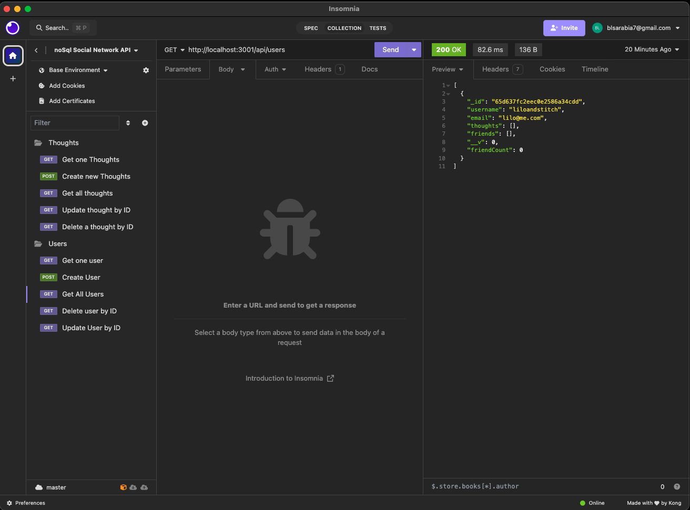

# noSql-Social-Network-API

## Name
noSql-Social-Network-API

## Description
This API for a social network web application that allows users to share their thoughts, react to friends' thoughts, and create a friend list. This API is built using Express.js for routing and MongoDB as the NoSQL database, with Mongoose ODM for object modeling.

## Visuals

GitHub Repo Link: https://github.com/brendaleea/noSql-Social-Network-API

Video Link : https://drive.google.com/file/d/1c-1xh5n6MrO_5weujMO-fYsj9NPF1B_1/view

## Installation
This project was created using JS,Express.js API, MongoDB, NoSQL database

## Install instructions & Steps
1. node.index.js

## Support
If you have any questions please feel free to contact me via slack 